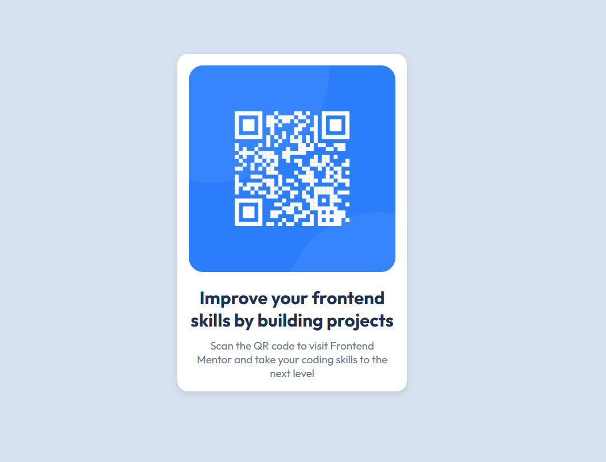

# Frontend Mentor - QR Code Component Solution

This is a solution to the [QR Code Component challenge on Frontend Mentor](https://www.frontendmentor.io/challenges/qr-code-component-iux_sIO_H). Frontend Mentor challenges help you improve your coding skills by building realistic projects.

## Table of contents

- [Overview](#overview)
  - [Screenshot](#screenshot)
  - [Links](#links)
- [My process](#my-process)
  - [Built with](#built-with)
  - [What I learned](#what-i-learned)
  - [Continued development](#continued-development)
- [Author](#author)

---

## Overview

### Screenshot



### Links

- Solution URL: [Add your solution link here](https://www.frontendmentor.io/solutions/qr-code-component-using-html-and-css-pf8f1-fDqy)
- Live Site URL: [Add live site URL here](https://adesolasarah.github.io/qr-code-component-main/)

---

## My process

### Built with

- Semantic HTML5 markup
- CSS custom properties
- Flexbox
- Mobile-first workflow

### What I learned

While working on this project, I learned how to:

- Center elements using **Flexbox**.
- Apply **box-shadow** and **border-radius** for modern card designs.
- Use Google Fonts in a project.

Here’s a snippet I’m proud of:

```css
body {
  background-color: hsl(212, 45%, 89%);
  display: flex;
  justify-content: center;
  align-items: center;
  height: 100vh;
}
```

### Continued Development

I plant to focus more on:

- Improving responsive design skills.
- Writing clean, maintainable CSS.
- Working with CSS Grid in Future challenges.

## Author

- Frontend Mentor: [text](https://www.frontendmentor.io/profile/adesolasarah)
  -Twitter Handle: theadesolasarah
